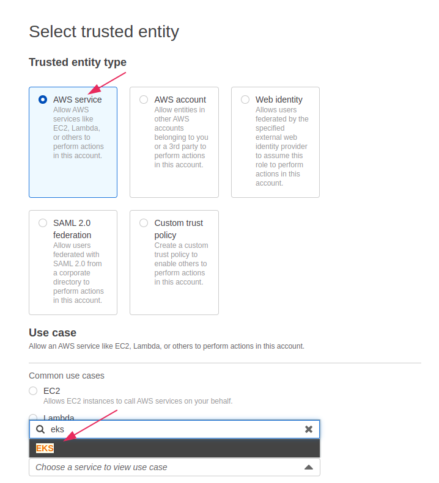
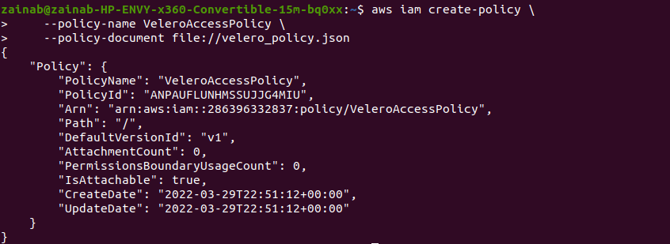
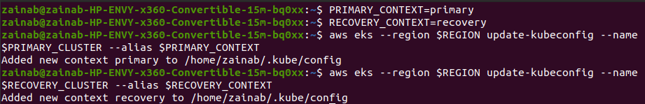
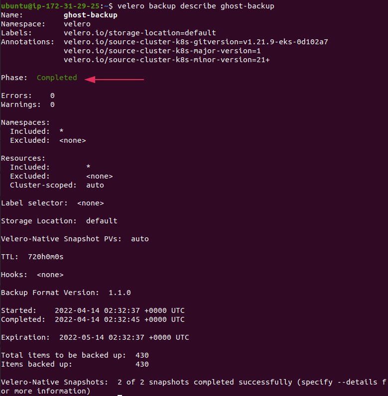

# **Backup and restore your Amazon EKS cluster resources using Velero**

**Velero** is an open-source backup and disaster recovery tool that makes it easy to perform backup and disaster recovery operations in Kubernetes. Velero offers data protection features such as scheduled backups, retention schedules, and ore- or post-backup hooks for custom actions. It protects data stores in persistent volumes and makes Kubernetes cluster more resilient. 

AWS customers can leverage this solution to centrally backup and restore Kubernetes objects and applications from and to `Amazon Kubernetes Service`. The managed solution provides highly available, secure clusters and automates key tasks such as patching, node provisioning, and updates. 

**Amazon Elastic Kubernetes Service** known as `Amazon EKS` is a managed Kubernetes service that makes it easy to run Kuberenetes on AWS and on-premise. 

In this project, we will focus on how to use Velero to backup, restore, and migrate your Amazon EKS cluster resources. We will understand the backup options that Velero offers to decide which approach best suits your use case. 

## Velero and Amazon EKS

An application level backup in AMazon EKS targets two components:

Kubernetes objects and configuration stored in the `etcd` key/value store
Application data stored in persistent volumes

**`etcd`** is an open source distributed key-value store used to hold and manage the critical information that distributed systems need to keep running. It manages the configuration data, state data and metadata for Kubernetes. In Amazon EKS, the `etcd` key/value store is managed by AWS and is only accessible through the Kubernetes API server. 

## Backup and restore workflow

Velero consist of two components:
A Velero server pod that runs in your Amazon EKS cluster
A common-line client (Velero CLI) that runs locally

## Project 

Now let us jump into the project. You will use Velero to backup an application in one cluster and restore the application in another. You will also use the open source `Ghost` publishing platform to demonstrate how to backup and restore not only an application definition but also its state stored on an EBS volume using a (PVC). 

**Ghost** is a free and open source blogging platform written in Javascript  for new-media creators to publish, share, and grow a business around their content. It focuses primarily on managing behind the scenes activities and supervises other contents and posts. 

### **Prerequisites**
You need the following to complete this project:

* `eksctl` v0.58 or greater.
* Two EKS Clusters in the same AWS account.
    * The two clusters will be referred to as the `Primary` and `Recovery` clusters. 
    * Each cluster must be configured with an **EKS IAM OIDC Provider**. This will grant the required AWS permissions to the Velero deployments 
* AWS CLI version 2 .
* Helm v3
* `kubectl`

#### **Installing eksctl**

Use this link to complete your installation of `eksctl`:

https://docs.aws.amazon.com/eks/latest/userguide/eksctl.html#installing-eksctl 

>

### **Creating an EKS Cluster in Amazon**

#### **Step 1 - Creating an EKS role**

First we create an EKS role by login into AWS account and search for *IAM*. Select *IAM* to navigate to its console. 

>

Navigate to **Role** on the left bar and select **Create role**.

>

On the **Select trusted entity** page, select **AWS service** as trusted entity type and from the drop down under **use cases for other AWS services**, search for  **EKS**, select **EKS - Cluster** and then select **Next**. 

>

On the **Add permissions** page, the `AmazonEKSClusterPolicy` is added by default. Leave the default and select **Next**. 

>

On the **Name, review and create** page, give your role a **name** and you may add a description (optional). Scroll to the bottom of the page and select **Create role**. 

>

>

The page will refresh, and you will be navigated to all the Roles, where you will find the newly created role. 

>

#### **Step 2 - Creating the Cluster**

Start by searching for EKS in the search box then select **Elastic Kubernetes Service** from the options that pop up. 

>

Select **Add cluster** and the select **create**.

>

On the **Configure cluster** page, use the following:

**Name**  -  type the cluster name **Primary**. 

**Cluster Service Role** - select the EKS role create

Leave the default setting for everything else and click **Next**.

>

On the **Specify networking** page, choose your subnet. Three subnets is a good amount, leave everything else as default and click **Next**. 

Click **Next** on the **Configure logging** page and on the **Review and create** page, click **Create**. 

>

It will take a few minutes for the cluster to be created.

Navigate to  **clusters** on the left bar under **Amazon EKS**.

Once your cluster is created, the status will be **Active**.

>

***Repeat the process above and name the second cluster `Recovery`***

### **Installing AWS CLI**

Install AWS CLI version 2. You can use the link below to install or update AWS CLI.

https://docs.aws.amazon.com/cli/latest/userguide/getting-started-install.html

>

### **Configure EKS IAM OIDC Provider**

View your OIDC provider URL 

    $ aws eks describe-cluster --name my-cluster --query "cluster.identity.oidc.issuer" --output text

> $ aws eks describe-cluster --name Recovery --query "cluster.identity.oidc.issuer" --output text

>

Create an IAM OIDC identity provider:

    $ eksctl utils associate-iam-oidc-provider --cluster my-cluster --approve

 > $eksctl utils associate-iam-oidc-provider --cluster Recovery --approve

>

Now to verify and list the IAM OIDC providers in your account. Replace `EXAMPLED539D4633E53DE1B716D3041E` with the value returned from the first command.

    $ aws iam list-open-id-connect-providers | grep EXAMPLED539D4633E53DE1B716D3041E

> $ aws iam list-open-id-connect-providers | grep 3B766E8428CB9EC7A240C60A693C069E

>

***Repeat the process for your second cluster*** 

#### **Installing Helm**

Use the link below to install `Helm` v3.

https://helm.sh/docs/intro/install/
>

#### **Installing Kubectl**

Use the link below to install `kubectl`.

https://docs.aws.amazon.com/eks/latest/userguide/install-kubectl.html

>

Now that you have all the prerequisites, let's get started.

### **Install Velero**

There are a few things that are required to install Velero using EKS best practices. First, we will need to create an S3 bucket to store the backups.  We will then use **IAM roles** for service accounts to grant Velero the necessary permissions to perform backup and restore operations.

#### **Step 1 - Create an S3 Bucket to store backups**

Velero uses S3 to store EKS backups when running in AWS. 

Run:

    $ BUCKET=<BUCKETNAME>

Then:

    $ REGION=<REGION>

Finally:

    $ aws s3 mb s3://$BUCKET --region $REGION

>Example:
>
>BUCKET=skillembassy-eks-velero-backup
>
>REGION=us-east-1
>
>aws s3 mb s3://$BUCKET --region $REGION
>
>

>

If you navigate to **S3** in your amazon account, you should see that the bucket has been created.
>

#### **Step 2 - Creating IAM Policy**

Velero performs a number of API calls to resources in **EC2** and **S3** to perform snapshots and save the backup to the S3 bucket. We need to create an **IAM Policy** that will grant the necessary permission. 

You need to create a `json` file, this can be done using an editor or the `cat` command:

    cat > velero_policy.json <<EOF
    {
        "Version": "2012-10-17",
        "Statement": [
            {
                "Effect": "Allow",
                "Action": [
                    "ec2:DescribeVolumes",
                    "ec2:DescribeSnapshots",
                    "ec2:CreateTags",
                    "ec2:CreateVolume",
                    "ec2:CreateSnapshot",
                    "ec2:DeleteSnapshot"
                ],
                "Resource": "*"
            },
            {
                "Effect": "Allow",
                "Action": [
                    "s3:GetObject",
                    "s3:DeleteObject",
                    "s3:PutObject",
                    "s3:AbortMultipartUpload",
                    "s3:ListMultipartUploadParts"
                ],
                "Resource": [
                    "arn:aws:s3:::${BUCKET}/*"
                ]
            },
            {
                "Effect": "Allow",
                "Action": [
                     "s3:ListBucket"
                ],
                "Resource": [
                    "arn:aws:s3:::${BUCKET}"
                ]
            }
        ]
    }
    EOF

>

Now run:

    $ aws iam create-policy \ --policy-name VeleroAccessPolicy \ --policy-document file://velero_policy.json

>

#### **Step 3 - Creating Service Accounts for Velero**

The best practice for providing AWS policies to applications running on EKS clusters is to use ***IAM Roles for Service Accounts***. `eksctl` provides an easy way to create the role and scope the trust relationship to the velero-server Service Account. 

Run:

    $ PRIMARY_CLUSTER=<CLUSTERNAME>

>PRIMARY_CLUSTER=Primary

Followed by:

    $ RECOVERY_CLUSTER=<CLUSTERNAME>

>RECOVERY_CLUSTER=Recovery

Then:

    $  ACCOUNT=$(aws sts get-caller-identity --query Account --output text)

Run to create service account for primary cluster:

    $ eksctl create iamserviceaccount \
    --cluster=$PRIMARY_CLUSTER \
    --name=velero-server \
    --namespace=velero \
    --role-name=eks-velero-backup \
    --role-only \
    --attach-policy-arn=arn:aws:iam::$ACCOUNT:policy/VeleroAccessPolicy \
    --approve

>

Finally run to create service account for recovery cluster:

    $ eksctl create iamserviceaccount \
    --cluster=$RECOVERY_CLUSTER \
    --name=velero-server \
    --namespace=velero \
    --role-name=eks-velero-recovery \
    --role-only \
    --attach-policy-arn=arn:aws:iam::$ACCOUNT:policy/VeleroAccessPolicy \
    --approve

>

***Note*** - The `--namespace=velero` flag ensures that only an application running in the **velero** namespace will have access to the IAM Policy created. 

#### **Step 4 - Installing Velero in both EKS Clusters**

The next step is to install Velero in both EKS clusters using the `Helm` chart. 

    $ helm repo add vmware-tanzu https://vmware-tanzu.github.io/helm-charts

>

Next, you will create two `.yaml` files; **values.yaml** and **values_recovery.yaml**.

    cat > values.yaml <<EOF
    configuration:
      backupStorageLocation:
        bucket: $BUCKET
      provider: aws
      volumeSnapshotLocation:
        config:
          region: $REGION
    credentials:
      useSecret: false
    initContainers:
    - name: velero-plugin-for-aws
      image: velero/velero-plugin-for-aws:v1.2.0
      volumeMounts:
      - mountPath: /target
        name: plugins
    serviceAccount:
      server:
        annotations:
          eks.amazonaws.com/role-arn: "arn:aws:iam::${ACCOUNT}:role/eks-velero-backup"
    EOF

Create the second file: 

    cat > values_recovery.yaml <<EOF
    configuration:
      backupStorageLocation:
        bucket: $BUCKET
      provider: aws
      volumeSnapshotLocation:
        config:
          region: $REGION
    credentials:
      useSecret: false
    initContainers:
    - name: velero-plugin-for-aws
      image: velero/velero-plugin-for-aws:v1.2.0
      volumeMounts:
      - mountPath: /target
        name: plugins
    serviceAccount:
      server:
        annotations:
          eks.amazonaws.com/role-arn: "arn:aws:iam::${ACCOUNT}:role/eks-velero-recovery"
    EOF

You will use `kubectl` to install the Velero server twice. Once in the `Primary` cluster and again in the `Recovery` cluster. 

For easier management of `kubectl` config, we add our clusters to kubeconfig with an alias:

    $ PRIMARY_CONTEXT=<CONTEXTNAME> 
>
    $ RECOVERY_CONTEXT=<CONTEXTNAME>
>

    $ aws eks --region $REGION update-kubeconfig --name $PRIMARY_CLUSTER --alias $PRIMARY_CONTEXT 

>PRIMARY_CONTEXT=Primary
>
>RECOVERY_CONTEXT=Recovery
>
>
>aws eks --region $REGION update-kubeconfig --name $RECOVERY_CLUSTER --alias $RECOVERY_CONTEXT

>

To verify the contexts: 

    $ kubectl config get-contexts

>

Note: the `”*”` indicates the context we are in. 

To navigate to the Primary cluster and install Velero, run:

    $ kubectl config use-context $PRIMARY_CONTEXT

>    

    $ helm install velero vmware-tanzu/velero \ --create-namespace \ --namespace velero \ -f values.yaml

Navigate to the Recovery cluster:

    $ kubectl config use-context $RECOVERY_CONTEXT

Then:

    $ helm install velero vmware-tanzu/velero \ --create-namespace \ --namespace velero \ -f values_recovery.yaml

>

To check your velero was successfully installed, run the command in each context:

    $ kubectl get pod - -namespace velero 

>

#### **Step 5 - Install the Velero CLI**

Velero operates by submitting commands as CRDs. To take a backup of the cluster, you submit a backup CRD to the cluster. This can be difficult to create manually, so Velero has created a CLI that makes it easy to perform backups and restore. You will be using the `Velero CLI` to create a backup of the `Primary` cluster and restore it to the `Recovery` cluster. 

Installing the CLI depends on your operating system. Use the following link to complete your installation 

https://velero.io/docs/v1.8/basic-install/#install-the-cli

If you are on Linux, you can follow the below:

    $ wget https://github.com/vmware-tanzu/velero/releases/download/v1.8.1/velero-v1.8.1-linux-amd64.tar.gz
 
Extract tarball:
 
    $ tar -zxvf velero-v1.8.1-linux-amd64.tar.gz
 
Now move the extracted binary:
 
    $ sudo mv velero-v1.8.1-linux-amd64/velero /usr/local/bin/
 

### **Backup and Restore Example Application**

Now that Velero is installed, we will move forward with installing an application on the Primary cluster.

#### **Step 1 - Install Ghost app**

**Ghost** will serve as the sample application that we will backup from the Primary cluster and restore to the Recovery cluster. You will use the Bitnami Helm chart as it is commonly deployed and well-tested. This chart depends on the ***Bitnami MariaDB*** chart that will serve as the persistent data store for the blog application. The MariaDB data will be stored in an EBS volume that will be snapshotted by Velero as part of performing the backup.

Switch to the Primary cluster’s context and install Ghost (ignore the notification ERROR: you did not provide an external host that appears when you install Ghost. This will be solved with the command below): 

    $ helm repo add bitnami https://charts.bitnami.com/bitnami

>

Now switch the context: 

    $ kubectl config use-context $PRIMARY_CONTEXT

To install Ghost:

    $ helm install ghost bitnami/ghost \ --create-namespace \ --namespace ghost

>

    $ export APP_HOST=$(kubectl get svc --namespace ghost ghost --template "{{ range (index .status.loadBalancer.ingress 0) }}{{ . }}{{ end }}")

>

    $ export GHOST_PASSWORD=$(kubectl get secret --namespace "ghost" ghost -o jsonpath="{.data.ghost-password}" | base64 --decode)

>

    $ export MARIADB_ROOT_PASSWORD=$(kubectl get secret --namespace "ghost" ghost-mariadb -o jsonpath="{.data.mariadb-root-password}" | base64 --decode)

>

    $ export MARIADB_PASSWORD=$(kubectl get secret --namespace "ghost" ghost-mariadb -o jsonpath="{.data.mariadb-password}" | base64 --decode)

>

    $ helm upgrade ghost bitnami/ghost \ --namespace ghost \ --set service.type=LoadBalancer \ --set ghostHost=$APP_HOST \ --set ghostPassword=$GHOST_PASSWORD \ --set mariadb.auth.rootPassword=$MARIADB_ROOT_PASSWORD \ --set mariadb.auth.password=$MARIADB_PASSWORD

>

To check that the installation is successful, run:

    $ kubectl get pod -n ghost 

>

#### **Step 2 - Create a blog post to demonstrate backup and restore of persistent volume**

Now that the installation is completed, the Chart will display the following in the console:

* The Blog URL 
* The Admin URL 
* The default admin user 
* Instructions to use kubectl to retrieve the password

>

Using the **Admin URL**, log into the Ghost Admin console and create an example blog post. This process will demonstrate that the backup includes not only the application deployment configuration but also the state of the blog database, which includes all of the posts. 

To create a post, select **Posts** in the left-hand navigation pane. 

>

Select **New Post** on the top right corner of the page

>

Add a post tite and write some content. To save the sample blog post, select the **Publish**  dropdown menu item in the top right corner of the page and then choose the **Publish** button. 

>

To view your blog, open a new browser and enter the blog URL. You will see your new blog post, a few sample blogs that are from the default installation as well as the default theme. 

>

#### **Step 3 - Create Backup**

The next step is to create a backup of the Primary cluster. Using `kubectl` make sure you are in the Primary cluster context before running the command below:

    $ velero backup create ghost-backup

>

To see how the backup CRD looks like, use the `-o` flag, which outputs the backup CRD YAML without submitting the backup creation to the Velero server. 

    $ velero backup create test -o yaml 

>

**Validate that the backup was Successful**

Now that you have created a backup, check the status of the backup and validate that it has been completed successfully. 

Run:

    $ velero backup describe ghost-backup

In the output, look for the field `Phase:`. If the current `Phase` is `InProgress`, then wait a few minutes and try again until you see `Phase: Completed`. The report includes additional information such as the start time, completion time, along with the number of items backed up. 

>

You can also find the backup files created by Velero in the Amazon S3 bucket:

    $ aws s3 ls $BUCKET/backups/ghost-backup/

>

### **Restore the Application**

Using `kubectl` switch into the Recovery cluster 

    $ kubectl config use-context $RECOVERY_CONTEXT

Using this command, restore only the Ghost application into the Recovery cluster:

    velero restore create ghost-restore \
        --from-backup ghost-backup \
        --include-namespaces ghost

>

The next step is to validate that the restore was successful. To check the status of restore: 

    $ velero restore describe ghost-restore

>

In the output, the `Phase:` should be `Completed`. If it shows `Phase: InProgress`, then wait a few minutes and run the command again. Retrieve the URL of the LoadBalancer for the Ghost blog in the Recovery cluster:

    $ kubectl -n ghost get svc ghost 

>

Verify that your blog has been restored by visiting the URL under `EXTERNAL -IP`. 

>

You have successfully backed up your Primary cluster and restored your application in the Recovery cluster.

### **Clean Up**

To avoid incurring charges while not using the resources, it is important to delete your cluster and the bucket created. This can be deleted using your AWS console or through the terminal. 

To delete the clusters using ekstcl on the terminal, run the below for both clusters:

    $ eksctl delete cluster <cluster-name>

>

To delete the S3 bucket created:

    $ aws s3 rb s3://$BUCKET --force

>

To delete the IAM role used by Velero:

    $ aws iam delete-policy --policy-arn arn:aws:iam::$ACCOUNT:policy/VeleroAccessPolicy

***Congratulations!!!!***